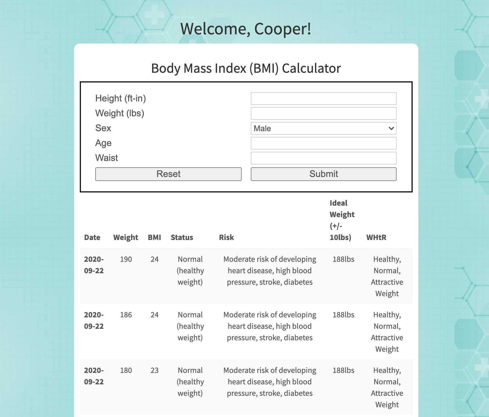

# Project2-BMI-Calculator

## TABLE OF CONTENTS
* [Description](#description)
* [Usage](#usage)
* [Technologies Used](#technologies)
* [Collaberators](#collaberators)
* [Examples](#examples)
* [Questions](#questions)

## Description
A simple web application that can be used to calculate, store, and track information regarding your Body Mass Index.

## Usage
Head to the signup page & create an account, or simply login to view your previous results. To get a new result, simply fill out the form and click "Submit". Your latest result will be added to the bottom of the graph. Enter in your new values periodically to track your progress!

## Collaberators
* [cdalt](https://github.com/cdalt)
* [gbrida](https://github.com/gbrida)

## Technologies Used
* Node
* Express
* Passport
* Lodash
* Axios
* Bcrypt.js
* Sequelize
* BMI Calculator - 3rd-Party API that takes in a JSON object (user-input) and returns calculated information regarding their BMI.
* Handlebars - server-side templating
* MySQL - database management

## Examples:
A screenshot of the results page (what you see once you are logged in) with some example data:

## Questions?
Please direct all questions to cseibert2667@gmail.com, and be sure to check out my other projects at [cseibert2667](https://www.github.com/cseibert2667).
